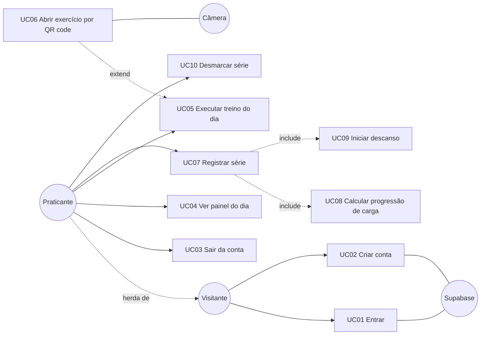
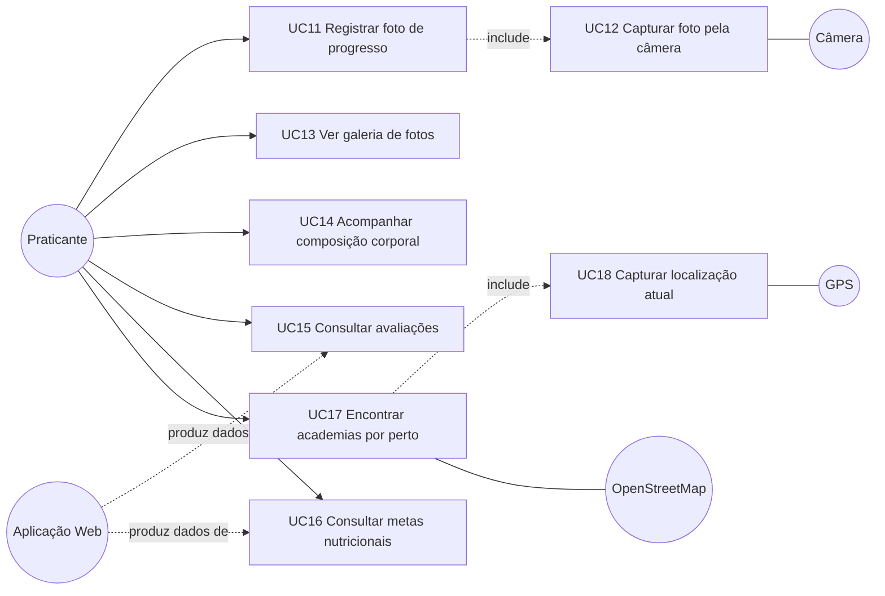
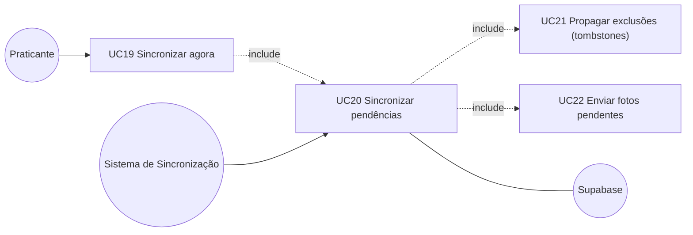

# 2 · Diagrama de Casos de Uso

[← Requisitos](01-requisitos.md) · [Índice](README.md) · [Próximo: Classes e dados →](03-classes-e-dados.md)

## Atores

| Ator | Tipo | Papel |
|---|---|---|
| **Visitante** | Pessoa | Quem abre o app sem sessão. Só alcança Entrar e Criar conta. |
| **Praticante** | Pessoa — **herda de Visitante** | Visitante com sessão válida. Herda os casos de uso de autenticação (na prática o `Stack.Protected` esconde login/cadastro enquanto a sessão existe, e eles voltam a aparecer ao sair da conta). |
| **Sistema de Sincronização** | Ator de tempo / background | O hook `useWorkoutSync`, disparado por abertura da área logada, reconexão (NetInfo) e retorno ao primeiro plano (AppState). |
| **Supabase** | Sistema externo | Auth, Postgres e Storage. |
| **OpenStreetMap (Overpass API)** | Sistema externo | Fonte das academias por perto. |
| **Aplicação Web Px GYM** | Sistema externo | Onde o laudo em PDF é enviado e o plano nutricional é gerado; o mobile só lê o resultado. |
| **Câmera do dispositivo** | Hardware | Foto de progresso e leitura de QR. |
| **GPS do dispositivo** | Hardware | Posição atual para a busca de academias. |

## Diagramas

Divididos em três recortes para caber na tela; os ids (UCxx) são únicos no documento todo.

### 2.a Conta e treino



### 2.b Fotos, consultas e academias



### 2.c Sincronização



### Notação textual

```
Ator: Visitante
Ator: Praticante (herda de Visitante)
Ator: Sistema de Sincronização (ator de tempo/background)
Atores externos: Supabase, OpenStreetMap, Aplicação Web, Câmera, GPS

UC01 Entrar
UC02 Criar conta
UC03 Sair da conta
UC04 Ver painel do dia                      (dado local + remoto)
UC05 Executar treino do dia                 (offline)
  <<extend>> UC06 Abrir exercício por QR code (ponto de extensão: escolher exercício)
UC07 Registrar série                        (offline)
  <<include>> UC08 Calcular progressão de carga
  <<include>> UC09 Iniciar descanso
UC10 Desmarcar série                        (offline)
UC11 Registrar foto de progresso            (offline)
  <<include>> UC12 Capturar foto pela câmera
UC13 Ver galeria de fotos                   (offline)
UC14 Acompanhar composição corporal         (online)
UC15 Consultar avaliações                   (online)
UC16 Consultar metas nutricionais           (online)
UC17 Encontrar academias por perto          (online)
  <<include>> UC18 Capturar localização atual
UC19 Sincronizar agora                      (Praticante)
  <<include>> UC20
UC20 Sincronizar pendências                 (Sistema de Sincronização)
  <<include>> UC21 Propagar exclusões (tombstones)
  <<include>> UC22 Enviar fotos pendentes
```

`UC08` e `UC09` são *include* porque acontecem **sempre** que uma série é registrada (a carga anterior é lida e o descanso dispara). `UC06` é *extend* porque é um atalho opcional: o treino funciona inteiro pela lista.

## Descrição textual dos casos de uso principais

### UC01 — Entrar

| | |
|---|---|
| **Ator** | Visitante |
| **Pré-condição** | Sem sessão salva no aparelho. |
| **Fluxo principal** | 1. Visitante informa e-mail e senha e toca "Entrar". 2. `SignInUseCase` valida o formato do e-mail e a presença de senha. 3. `AuthGateway` (Supabase Auth) autentica. 4. A sessão é salva cifrada (LargeSecureStore) e o `Stack.Protected` troca para a área logada. |
| **Alternativo A1 — dado inválido** | Em 2, e-mail malformado ou senha vazia: a mensagem aparece **sem ida à rede**. |
| **Alternativo A2 — credencial recusada** | Em 3, "E-mail ou senha inválidos." ou "Confirme seu e-mail pelo link que enviamos". |
| **Alternativo A3 — sem rede** | Em 3, o provedor não responde (modo avião, DNS, projeto pausado): "Sem conexão com o servidor. Confira sua internet…" — o app **não** culpa a senha. |
| **Pós-condição** | Sessão persistida; próximas aberturas entram direto, inclusive offline (RF04). |

### UC02 — Criar conta

| | |
|---|---|
| **Ator** | Visitante |
| **Pré-condição** | Sem sessão. |
| **Fluxo principal** | 1. Informa e-mail, senha e confirmação. 2. `SignUpUseCase` valida e-mail, tamanho mínimo (6) e igualdade das senhas. 3. `AuthGateway` cria a conta. 4. Com sessão imediata, entra na área logada. |
| **Alternativo A1 — confirmação de e-mail** | Em 4, o projeto exige confirmação: a conta nasce sem sessão; o app mostra "Enviamos um link de confirmação" e para de carregar. |
| **Alternativo A2 — recusa** | E-mail já cadastrado, senha fraca, limite de tentativas ou sem rede: mensagem específica. |
| **Pós-condição** | Conta criada no Supabase Auth. |

### UC07 — Registrar série (com UC08 e UC09)

| | |
|---|---|
| **Ator** | Praticante |
| **Pré-condição** | Sessão válida; migrations do SQLite aplicadas no boot; exercício aberto. |
| **Fluxo principal** | 1. Ajusta a carga no stepper (±2,5 kg). 2. Toca o check da série. 3. `RegisterSetUseCase` lê a última carga do exercício no SQLite (UC08), cria o `SetLog` com UUID do cliente e status `pending` e grava. 4. A tela marca a série (háptico + animação), mostra o delta de carga e inicia o descanso do exercício (UC09). 5. A curva de progressão e o painel se atualizam via `useLiveQuery`. 6. Uma sincronização oportunista é disparada em segundo plano. |
| **Alternativo A1 — sem rede** | Em 6, `ConnectivityStatus` diz offline e nada é enviado; o registro fica `pending` e sobe no próximo gatilho do UC20. Para o usuário, o fluxo é idêntico. |
| **Alternativo A2 — servidor recusa** | Em 6, o envio falha: o resultado é `error`, o registro fica `pending`; nenhum alerta interrompe o treino. |
| **Alternativo A3 — toque duplo** | Toques repetidos no mesmo check enquanto a escrita está em andamento são ignorados. |
| **Pós-condição** | Série persistida localmente; eventualmente espelhada em `set_logs` no Supabase. |

### UC10 — Desmarcar série

| | |
|---|---|
| **Ator** | Praticante |
| **Pré-condição** | Série marcada na sessão do dia. |
| **Fluxo principal** | 1. Toca o check de uma série concluída. 2. `UnregisterSetUseCase` busca o registro. 3a. Se `pending` (nunca subiu), apaga a linha local. 3b. Se `synced`, marca como `deleted` (tombstone), que some de todas as leituras. 4. O descanso em andamento é cancelado. |
| **Alternativo A1 — sem rede** | O tombstone espera o próximo gatilho do UC21; a série não "ressuscita" na próxima leitura. |
| **Pós-condição** | Série fora da interface; exclusão remota pendente (3b) ou nada a avisar (3a). |

### UC11 — Registrar foto de progresso (com UC12)

| | |
|---|---|
| **Ator** | Praticante |
| **Pré-condição** | Sessão válida. |
| **Fluxo principal** | 1. Em Fotos, toca "Tirar foto de hoje". 2. A tela de câmera verifica a permissão. 3. Captura (JPEG 0,85) — UC12. 4. O arquivo é movido do cache para `documents/progress-photos/<uuid>.jpg`. 5. `SaveProgressPhotoUseCase` grava `ProgressPhoto` como `pending` e, havendo rede, faz o upload e marca `synced`. 6. Volta para a galeria, que já mostra a foto. |
| **Alternativo A1 — permissão negada** | Em 2, cartão explicando o uso da câmera, com "Permitir câmera" e a saída "Agora não". |
| **Alternativo A2 — sem rede / upload falha** | Em 5, a foto fica `pending` (ponto âmbar) e sobe no UC22. |
| **Pós-condição** | Foto no armazenamento permanente do app e registrada no SQLite. |

### UC17 — Encontrar academias por perto (com UC18)

| | |
|---|---|
| **Ator** | Praticante |
| **Pré-condição** | Sessão válida. |
| **Fluxo principal** | 1. Abre Academias. 2. `FindNearbyGymsUseCase` consulta a permissão **sem** abrir diálogo. 3. Com permissão, lê a posição pelo `LocationGateway` (UC18). 4. Consulta o Overpass num raio de 4 km. 5. Calcula a distância real (haversine), descarta o que está fora do raio e ordena. 6. Mostra mapa + lista. |
| **Alternativo A1 — permissão ainda não concedida** | Em 2, cartão "Acesso à localização"; o toque em "Permitir localização" repete o caso de uso com `askPermission: true`, e aí o diálogo do sistema abre. |
| **Alternativo A2 — permissão bloqueada** | Negada sem poder perguntar de novo: botão "Abrir configurações"; ao voltar ao app, a busca roda de novo sozinha. |
| **Alternativo A3 — sem fix de GPS** | Em 3, o gateway cai para a última posição conhecida; sem nenhuma, "Não achamos sua localização" + tentar de novo. |
| **Alternativo A4 — sem rede / Overpass fora** | Em 4, "Não deu pra buscar agora" + tentar de novo. |
| **Pós-condição** | Nenhuma: a posição não é persistida (RNF04). |

### UC20 — Sincronizar pendências (com UC21 e UC22)

| | |
|---|---|
| **Ator** | Sistema de Sincronização (também acionado pelo Praticante via UC19) |
| **Pré-condição** | Sessão válida (o hook só roda na área logada). |
| **Gatilhos** | Montagem da área logada · NetInfo anuncia conexão · app volta ao primeiro plano · botão "Sincronizar agora". Uma trava impede duas rodadas simultâneas. |
| **Fluxo principal** | 1. `SyncPendingSetLogsUseCase` consulta `ConnectivityStatus`. 2. Lê pendentes e tombstones. 3. `upsert` dos pendentes (`onConflict: id`) e marca `synced`. 4. UC21: `delete` remoto dos tombstones (filtrando por `user_id`) e só então apaga localmente. 5. UC22: `SyncPendingPhotosUseCase` envia cada foto pendente ao bucket e faz upsert da linha. |
| **Alternativo A1 — offline** | Em 1, resultado `offline` sem nenhuma requisição. |
| **Alternativo A2 — backend recusa** | Em 3 ou 4, resultado `error`; o que não foi confirmado permanece `pending`/tombstone. Em 5, cada foto falha sozinha e as outras seguem. |
| **Pós-condição** | SQLite e Supabase convergem; Configurações mostra "Tudo sincronizado com a nuvem". |

### Casos de uso de consulta (UC04, UC13–UC16)

São leituras. **UC04** e **UC13** leem o SQLite (funcionam offline). **UC14–UC16** leem o Supabase com recarga a cada foco da tela e três estados explícitos (carregando, erro, pronto). Sem rede, mostram o estado de erro previsto no RNF02.
