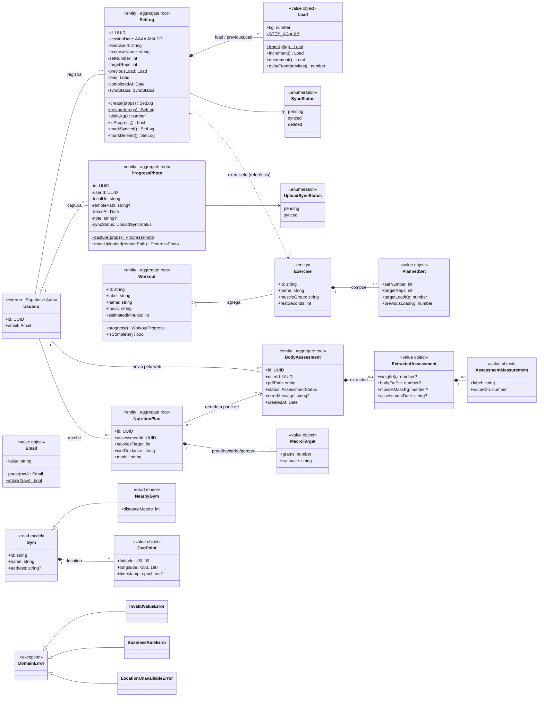
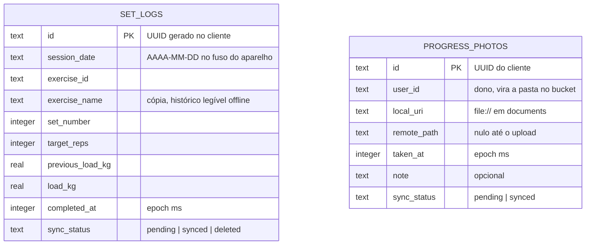
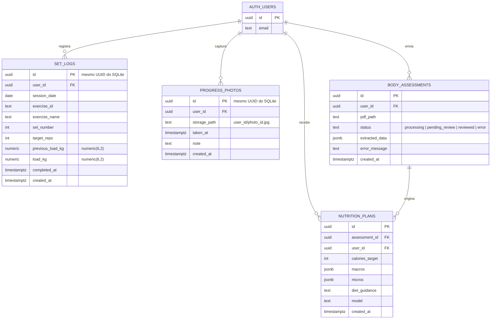

# 3 · Diagrama de Classes e Modelo de Dados

[← Casos de uso](02-casos-de-uso.md) · [Índice](README.md) · [Próximo: Objetos →](04-objetos.md)

As classes saíram dos substantivos dos casos de uso (série, carga, exercício, treino, foto, avaliação, plano, academia, localização, e-mail) e estão implementadas em `packages/core/src` — o mesmo nome no diagrama e no código.

## Controle de sincronização nas entidades

A skill pede quatro atributos de controle em toda entidade sincronizável. O Px GYM cobre a intenção de cada um com uma decisão própria, registrada aqui:

| Atributo da skill | No Px GYM | Por quê |
|---|---|---|
| `id` UUID do cliente | **Sim** — `SetLog.id` e `ProgressPhoto.id` vêm de `expo-crypto.randomUUID()` pelo port `IdGenerator` | Criar offline sem colisão e tornar o envio idempotente. |
| `updated_at` (last-write-wins) | **Não** | Registros são **imutáveis**: corrigir uma série é desmarcar (apagar) e marcar de novo (id novo). Sem edição não há o que desempatar; o `upsert` por id já é LWW por linha. |
| `deleted_at` (soft delete) | **Sim, como estado** — `syncStatus = "deleted"` (tombstone) | Mesmo efeito do `deleted_at`: a linha não é apagada antes de o servidor confirmar. Um enum evita um segundo campo para o mesmo fato. |
| `sync_status` | **Sim** — `pending · synced · deleted` (séries) e `pending · synced` (fotos) | O estado `error` da skill é **transitório**: vira o resultado `error` do caso de uso de sync e a linha continua `pending` (ver [§5](05-estados.md)). |

## Diagrama de classes

**Leitura das relações**

- **Composição (`*--`)**: a parte não existe sem o todo — `PlannedSet` dentro de `Exercise`, as duas `Load` dentro de `SetLog`, a extração dentro da avaliação.
- **Agregação (`o--`)**: `Workout` agrupa `Exercise`s que existem por conta própria (o mesmo exercício aparece em vários treinos).
- **Referência por id (`..>`)**: `SetLog` guarda `exerciseId` + uma cópia do nome — não segura o objeto `Exercise`. É o que mantém o histórico legível offline mesmo se o catálogo mudar.
- **Herança (`<|--`)**: `NearbyGym` é `Gym` + distância calculada; a hierarquia de erros do domínio.
- `Usuario` não é classe do domínio: é a identidade do Supabase Auth, presente como `userId` nas entidades. O e-mail entra no domínio pelo value object `Email`.
- `CardioSession` (corrida por GPS) existe no core, mas **nenhuma tela o usa** — ficou fora do diagrama e está listado como dívida na [§10](10-implementacao.md#lacunas-e-próximos-passos).

## Persistência local × remota

| Classe | Local (SQLite, Drizzle) | Remota (Supabase) | Estratégia |
|---|---|---|---|
| `SetLog` | Sim — tabela `set_logs` | Sim — tabela `set_logs` | Local é a fonte da verdade até o sync; depois, espelho. Escrita só pelo mobile (mão única), então o servidor nunca tem versão mais nova para disputar. |
| `ProgressPhoto` | Sim — arquivo em `documents/progress-photos/` + tabela `progress_photos` | Sim — bucket `progress-photos` + tabela `progress_photos` | Binário sobe separado dos metadados; a galeria **sempre** lê o arquivo local, mesmo depois de sincronizada. |
| `BodyAssessment` | Não | Sim — `body_assessments` + bucket `assessments` | Produzida pelo web; o mobile lê sob demanda (refetch no foco). |
| `NutritionPlan` | Não | Sim — `nutrition_plans` | Idem. |
| `Workout` / `Exercise` | Não (fixo em código) | Não | Treino do dia vem de `mock-data.ts` — RF06 parcial. |
| `Gym` / `NearbyGym` | Não | Não (Overpass em tempo real) | Consulta descartável; nada é guardado (RNF04). |
| `Usuario` / sessão | Sim — sessão cifrada (LargeSecureStore: chave AES no SecureStore, payload no AsyncStorage) | Sim — `auth.users` | Fonte da verdade: Supabase Auth. O cache local permite abrir o app offline. |
| Fila de sync | **Coluna** `sync_status` nas próprias tabelas | Não | Sem tabela `sync_queue` separada (desvio da skill): o registro é ao mesmo tempo o dado e o item da fila, então as duas coisas nunca divergem. |

## 3.1 Diagramas Entidade-Relacionamento (DER)

Regra de conversão aplicada: composição 1-N vira FK no lado "muitos"; value objects viram colunas embutidas (`Load` → `load_kg`/`previous_load_kg`) ou `jsonb` quando são listas produzidas por IA (`extracted_data`, `macros`, `micros`).

### Schema local — SQLite (`pxgym.db`, Drizzle, `apps/mobile/src/db/schema.ts`)

Índices: `set_logs(session_date)`, `set_logs(exercise_id, completed_at)`, `set_logs(sync_status)`, `progress_photos(user_id, taken_at)`, `progress_photos(sync_status)` — um por consulta real da interface. Migrations em `apps/mobile/drizzle/`, aplicadas no boot por `useMigrations` antes de qualquer tela tocar o banco.

As duas tabelas locais não têm relação entre si nem com `auth.users`: o app só guarda dados do usuário logado. `set_logs` local não tem `user_id` — o gateway de sync o acrescenta no envio (`toSetLogRow(log, userId)`).

### Schema remoto — Supabase / Postgres (`supabase/migrations/`)

### Conferência local × remoto

| Campo de negócio | SQLite | Postgres | Observação |
|---|---|---|---|
| `set_logs.id` | `text` | `uuid` | Mesmo valor dos dois lados — é o que torna o `upsert` idempotente. |
| `session_date` | `text` | `date` | Formato `AAAA-MM-DD` compatível. |
| cargas | `real` | `numeric(6,2)` | `Load` arredonda a 2 casas e limita a 1000 kg, dentro de `numeric(6,2)`. |
| `completed_at` / `taken_at` | `integer` (ms) | `timestamptz` | Convertidos pelo mapper (`toISOString()`). |
| `sync_status` | coluna | — | Só existe localmente (controle de fila). |
| `local_uri` | coluna | — | Caminho do aparelho; não faz sentido no servidor. |
| `storage_path` / `remote_path` | `remote_path` | `storage_path` | Mesmo valor (`<user_id>/<photo_id>.jpg`). |
| `user_id` | só em fotos | todas as tabelas | Séries locais pertencem implicitamente ao usuário logado. |
| `created_at` | — | default `now()` | Auditoria do servidor. |

Cardinalidades batem com o diagrama de classes: um usuário tem 0..N séries, fotos, avaliações e planos; uma avaliação origina 0..N planos.

### Row Level Security (RLS)

Toda tabela remota tem RLS ligada com políticas de dono. O app usa só a chave anônima; é a RLS que decide o que cada sessão vê.

| Tabela / bucket | select | insert | update | delete | Regra |
|---|---|---|---|---|---|
| `set_logs` | ✔ | ✔ | ✔ | ✔ | `auth.uid() = user_id` |
| `progress_photos` | ✔ | ✔ | ✔ | ✔ | `auth.uid() = user_id` |
| `body_assessments` | ✔ | ✔ | ✔ | ✔ | `auth.uid() = user_id` |
| `nutrition_plans` | ✔ | ✔ | — | ✔ | `auth.uid() = user_id` (plano não é editado) |
| storage `progress-photos` | ✔ | ✔ | — | ✔ | `(storage.foldername(name))[1] = auth.uid()::text` |
| storage `assessments` | ✔ | ✔ | — | ✔ | idem |

Além da RLS, o gateway de sync filtra o `delete` por `user_id` (defesa em profundidade, coberta por teste em `packages/db`).
