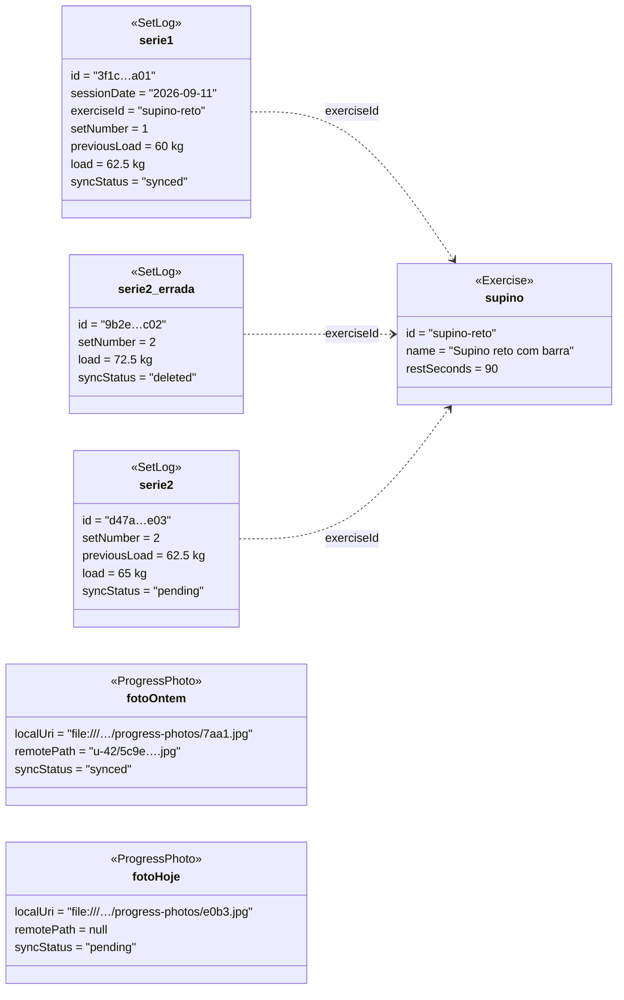

# 4 · Diagrama de Objetos

[← Classes e dados](03-classes-e-dados.md) · [Índice](README.md) · [Próximo: Estados →](05-estados.md)

Instantâneo do diagrama de classes com valores reais, escolhido para validar o cenário mais delicado do offline-first: **o mesmo dia de treino com registros em três estados de sincronização diferentes**, mais uma galeria parcialmente enviada.

**Cenário.** Praticante no supino, terça 11/09/2026, Wi-Fi da academia caindo:

1. Série 1 marcada às 19:00 com rede → subiu (`synced`).
2. Série 2 marcada às 19:03 → também subiu, mas o praticante percebeu que marcou errado e desmarcou às 19:04, já sem rede → virou tombstone (`deleted`).
3. Série 2 remarcada às 19:05 com a carga certa, ainda sem rede → `pending` (id novo).
4. Foto de progresso do dia anterior já na nuvem; a de hoje ainda não subiu.

## O que o instantâneo valida

| Pergunta | Resposta no modelo | Onde está garantido |
|---|---|---|
| A tela do exercício mostra quantas séries? | **2** (`serie1` e `serie2`) — o tombstone é invisível para leituras. | `bySessionDate` exclui `deleted`; teste *"tombstone some das leituras mas continua visível pro sync"* (`apps/mobile/src/db/__tests__/set-log-repository.test.ts`). |
| Qual é a "carga anterior" da `serie2`? | **62,5 kg** (a da `serie1`), e **não** os 72,5 kg da série apagada. | `lastLoadKgForExercise` ignora tombstones; mesmo teste. |
| O que a próxima sincronização faz? | `upsert` de `serie2`, depois `delete` remoto de `serie2_errada` e só então a remoção local; `upload` da `fotoHoje`. | `SyncPendingSetLogsUseCase` (ordem pendentes → exclusões) e `SyncPendingPhotosUseCase`; testes em `packages/core/src/__tests__/sync.test.ts`. |
| E se o `delete` falhar depois do `upsert` dar certo? | Resultado `error` com `synced: 1`; `serie2` fica `synced`, o tombstone continua esperando. | Teste *"push ok + delete falhando: conta o que subiu e segura o tombstone"*. |
| Configurações mostra o quê? | "Séries aguardando envio: 1 · Remoções aguardando envio: 1 · Fotos aguardando upload: 1". | `usePendingSync` (`apps/mobile/src/lib/use-local-data.ts`). |
| A galeria mostra as duas fotos offline? | Sim — ambas têm `localUri`; o ponto é volt em `fotoOntem` e âmbar em `fotoHoje`. | A galeria lê o arquivo local, nunca a URL remota. |

Esse mesmo cenário é a massa de dados dos testes de repositório e de sync citados — o diagrama de objetos virou teste (seção 10).
