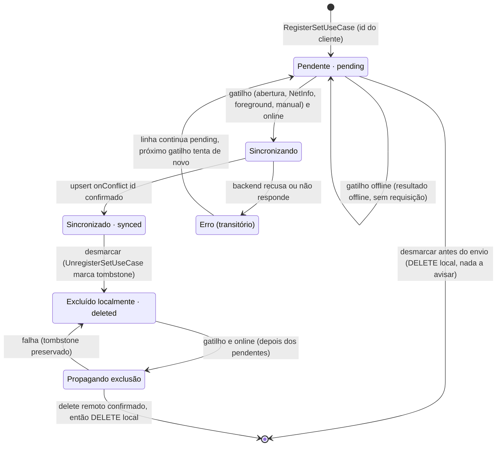
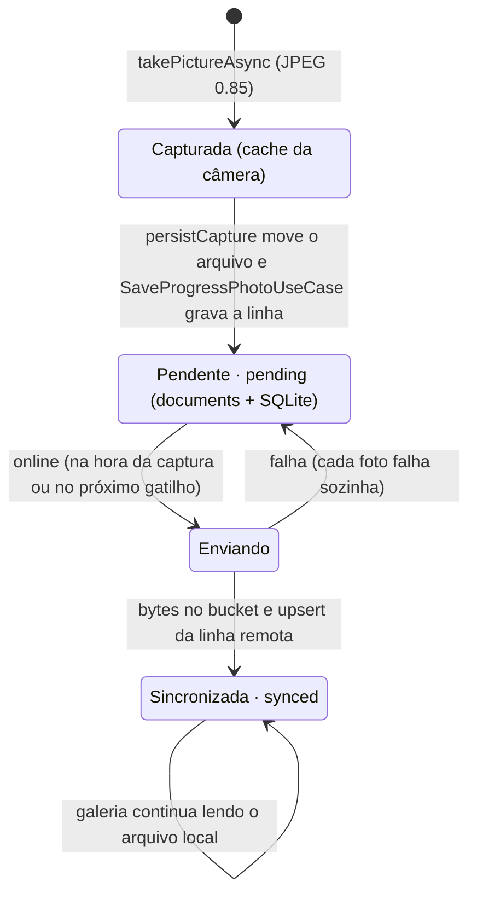
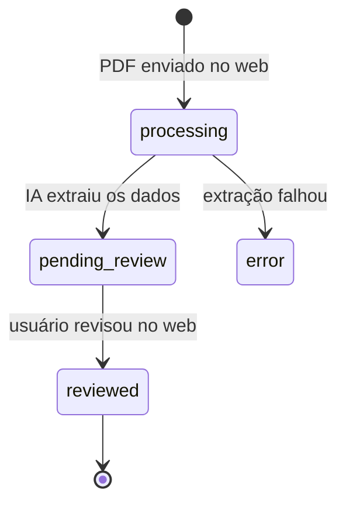
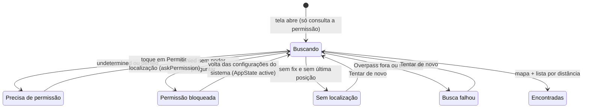

# 5 · Diagramas de Estados

[← Objetos](04-objetos.md) · [Índice](README.md) · [Próximo: Fronteira, controle e entidade →](06-fronteira-controle-entidade.md)

O Px GYM tem dois ciclos de **sincronização** (série e foto), um ciclo de **negócio** independente (avaliação física) e a máquina de estados da **busca de academias**, que organiza a tela mais cheia de caminhos alternativos. Os ciclos de sync e de negócio ficam em diagramas separados, como pede a skill.

## 5.1 Ciclo de sincronização de `SetLog`

Persistidos: `pending`, `synced`, `deleted` (coluna `sync_status`). **Transitórios** (existem só durante a execução do caso de uso): *Sincronizando*, *Erro*, *PropagandoExclusão*.

Regras que o diagrama impõe e onde estão no código:

- **Não existe `Sincronizado → Pendente`.** A skill prevê "nova edição local"; aqui o `SetLog` é imutável — corrigir carga é desmarcar e marcar de novo, gerando um id novo. Isso elimina conflito de edição.
- A troca de estado nunca é "solta": só acontece por `SetLog.markSynced()` / `markDeleted()` (entidade) e pelos casos de uso `RegisterSet`, `UnregisterSet` e `SyncPendingSetLogs`.
- *Erro* não é persistido de propósito: como a sincronização só roda em gatilhos (sem laço), não há risco de martelar o servidor, e a linha `pending` já é o "retry". A consequência — um registro que o servidor rejeita sempre bloqueia o lote — está nas [lacunas](10-implementacao.md#lacunas-e-próximos-passos).

## 5.2 Ciclo de upload de `ProgressPhoto`

O passo *Cache → Pendente* é o que torna a foto durável: o cache pode ser limpo pelo sistema a qualquer momento; `documents/` não. Foto não tem exclusão pelo app hoje, por isso não há estado `deleted`.

## 5.3 Ciclo de negócio de `BodyAssessment` (produzido pelo web)

O mobile **só lê** esse ciclo: a lista de avaliações mostra o status, e as métricas corporais usam avaliações `reviewed` ou `pending_review` que tenham dados extraídos. A regra "só gera plano nutricional de avaliação revisada" mora no `GenerateNutritionPlanUseCase` do core.

## 5.4 Estados da busca de academias

Os estados são exatamente os resultados do `FindNearbyGymsUseCase` — a tela só os desenha.

