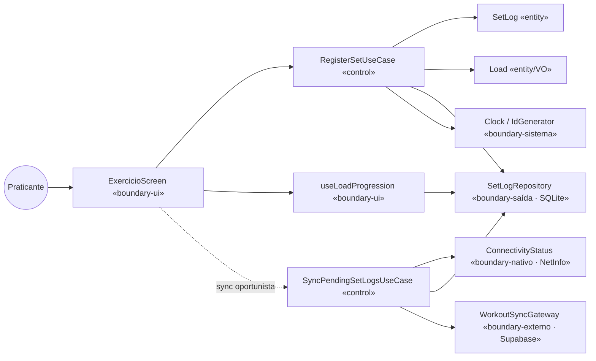
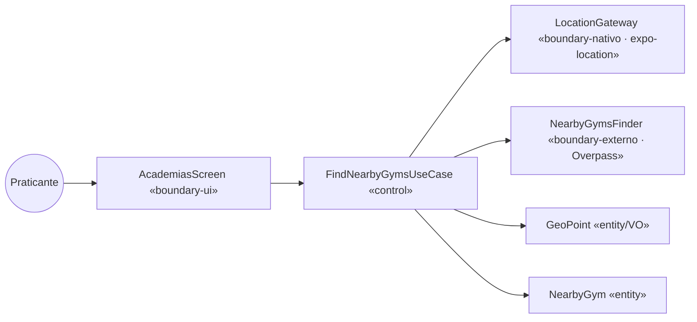
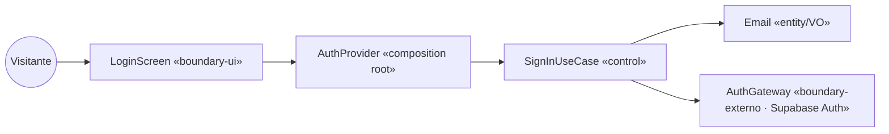

# 6 · Classes de Fronteira, Controle e Entidade

[← Estados](05-estados.md) · [Índice](README.md) · [Próximo: Sequência →](07-sequencia.md)

Reclassificação que vira, na [§10](10-implementacao.md), as camadas da Clean Architecture. Em app mobile a fronteira tem dois lados: a **UI** (telas Expo Router) e os **recursos nativos/externos** (GPS, câmera, rede, Supabase, Overpass) — ambos são ponto de contato com algo fora do domínio.

| Estereótipo | No Px GYM | Onde mora |
|---|---|---|
| **«boundary-ui»** | Telas `…Screen` e hooks de leitura (`useLoadProgression`, `usePendingSync`, `useProgressPhotos`, `useAssessments`…) | `apps/mobile/src/app`, `apps/mobile/src/lib/use-*.ts` |
| **«boundary-nativo/externo»** | Interface (port) no domínio + implementação no adapter: `LocationGateway`/`ExpoLocationGateway`, `ConnectivityStatus`/`netInfoConnectivity`, `AuthGateway`/`SupabaseAuthGateway`, `WorkoutSyncGateway`/`SupabaseWorkoutSyncGateway`, `ProgressPhotoUploader`/`SupabaseProgressPhotoUploader`, `NearbyGymsFinder`/`OverpassGymFinder` | ports em `packages/core/src/ports`; adapters em `apps/mobile/src/lib` e `packages/db/src` |
| **«boundary-saída» (persistência)** | `SetLogRepository`/`DrizzleSetLogRepository`, `ProgressPhotoRepository`/`DrizzleProgressPhotoRepository`, `AssessmentRepository`/`SupabaseAssessmentRepository`, `NutritionPlanRepository`/`SupabaseNutritionPlanRepository` | ports no core; adapters em `apps/mobile/src/db` e `packages/db/src/repositories` |
| **«control»** | `…UseCase` — orquestra, não guarda estado, conhece só ports | `packages/core/src/use-cases` |
| **«entity»** | Classes da [§3](03-classes-e-dados.md) | `packages/core/src/entities`, `value-objects` |

Regra: 1 boundary de UI por tela; 1 gateway por recurso externo; 1 control por caso de uso; nenhum control importa `expo-*`, `drizzle-orm` ou `@supabase/supabase-js` (verificado: `packages/core` não importa nenhum pacote externo).

## Diagramas de robustez

### UC07 Registrar série

### UC17 Encontrar academias por perto

### UC01 Entrar

## Tabela de mapeamento por caso de uso

| Caso de uso | Boundary (UI) | Boundary (nativo/externo/saída) | Control | Entities |
|---|---|---|---|---|
| UC01 Entrar | `LoginScreen` | `AuthGateway` → `SupabaseAuthGateway` | `SignInUseCase` | `Email` |
| UC02 Criar conta | `CadastroScreen` | `AuthGateway` → `SupabaseAuthGateway` | `SignUpUseCase` | `Email` |
| UC03 Sair da conta | `ConfiguracoesScreen`, `PerfilScreen` | `AuthGateway.signOut` | — (delegação direta, sem regra de negócio) | — |
| UC04 Ver painel do dia | `InicioScreen` + `useStreakDays`, `useWeekActivity`, `useBodyMetrics` | `SetLogRepository` (SQLite), `AssessmentRepository` (Supabase) | serviços `computeStreakDays`, `computeWeekActivity`, `buildBodyHistory` | `SetLog`, `BodyAssessment`, `Workout` |
| UC05 Executar treino do dia | `TreinoScreen` + `useTodayDoneByExercise` | `SetLogRepository` | `Workout.progress()` | `Workout`, `Exercise`, `SetLog` |
| UC06 Abrir exercício por QR | `ScannerScreen` | `CameraView` (expo-camera, componente de UI) | `parseExerciseId` (na tela) | `Exercise` |
| UC07 Registrar série | `ExercicioScreen` | `SetLogRepository`, `Clock`, `IdGenerator` | `RegisterSetUseCase` | `SetLog`, `Load` |
| UC08 Calcular progressão | `LoadProgressionCard` + `useLoadProgression` | `SetLogRepository` | `computeLoadProgression` | `SetLog` |
| UC10 Desmarcar série | `ExercicioScreen` | `SetLogRepository` | `UnregisterSetUseCase` | `SetLog` |
| UC11/UC12 Registrar foto | `CameraScreen` | `CameraView`, `persistCapture` (expo-file-system), `ProgressPhotoRepository`, `ProgressPhotoUploader`, `ConnectivityStatus` | `SaveProgressPhotoUseCase` | `ProgressPhoto` |
| UC13 Ver galeria | `FotosScreen` + `useProgressPhotos` | `ProgressPhotoRepository` (SQLite) | — (leitura) | `ProgressPhoto` |
| UC14 Composição corporal | `ProgressoScreen` + `useAssessments` | `AssessmentRepository` | `buildBodyHistory`, `historyDelta`, `diffMeasurements` | `BodyAssessment` |
| UC15 Avaliações | `AvaliacoesScreen` + `useAssessments` | `AssessmentRepository` | — (leitura) | `BodyAssessment` |
| UC16 Metas nutricionais | `NutricaoScreen` + `useLatestPlan` | `NutritionPlanRepository` | — (leitura) | `NutritionPlan` |
| UC17/UC18 Academias | `AcademiasScreen` | `LocationGateway` → `ExpoLocationGateway`, `NearbyGymsFinder` → `OverpassGymFinder` | `FindNearbyGymsUseCase` | `GeoPoint`, `Gym`, `NearbyGym` |
| UC19 Sincronizar agora | `ConfiguracoesScreen` + `usePendingSync` | como UC20 | como UC20 | como UC20 |
| UC20–UC22 Sincronizar pendências | (nenhuma — hook `useWorkoutSync` no layout da área logada) | `WorkoutSyncGateway` → `SupabaseWorkoutSyncGateway`, `ProgressPhotoUploader`, `ConnectivityStatus` → NetInfo | `SyncPendingSetLogsUseCase`, `SyncPendingPhotosUseCase` | `SetLog`, `ProgressPhoto` |

## Desvios conscientes

- **Câmera como componente, não gateway.** A skill sugere `CameraGateway`. No React Native a captura depende do preview (`<CameraView ref>`), que é UI; por isso a câmera fica na tela e o que vira port é o que vem depois dela — persistir o arquivo e enviar (`ProgressPhotoUploader`). Um `CameraGateway` só faria sentido com captura sem preview (ex.: `expo-image-picker`).
- **UC06 sem use case.** `parseExerciseId` (regex + busca no treino do dia) está na tela. Quando o treino deixar de ser mock, a validação deve ir para um `OpenExerciseByQrUseCase` que consulte o `WorkoutRepository`.
- **UC03 sem use case.** Sair não tem regra; a tela chama `AuthGateway.signOut` via `AuthProvider`.
