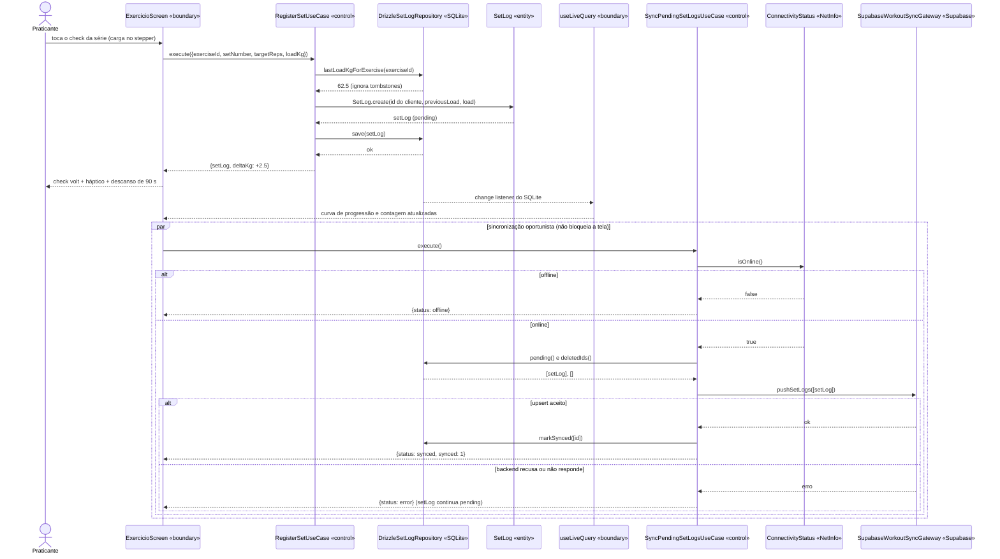
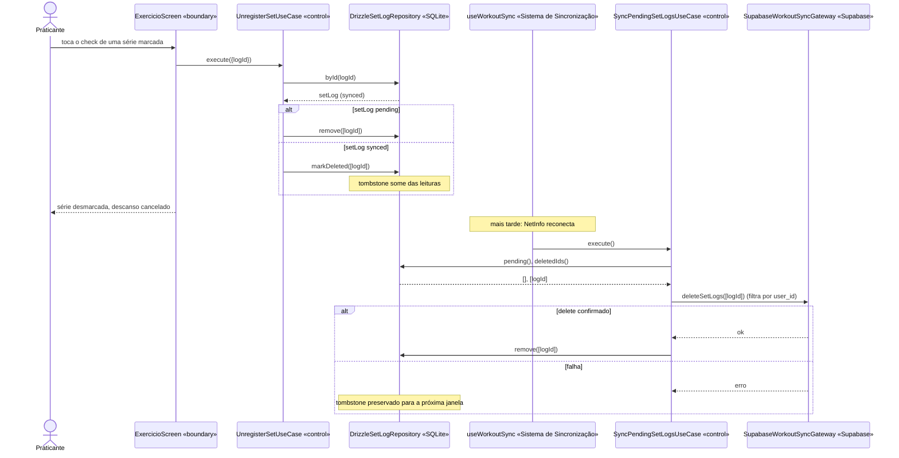
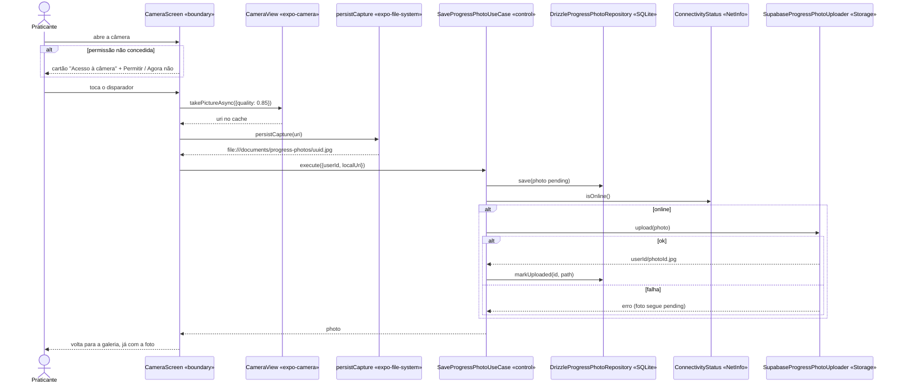
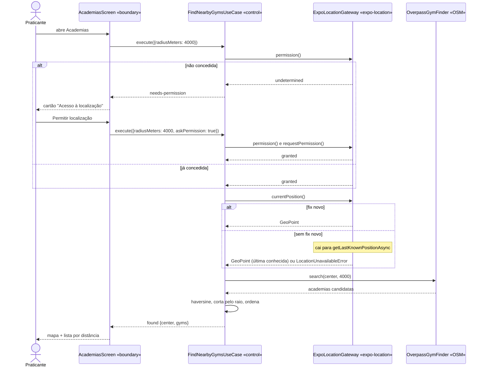
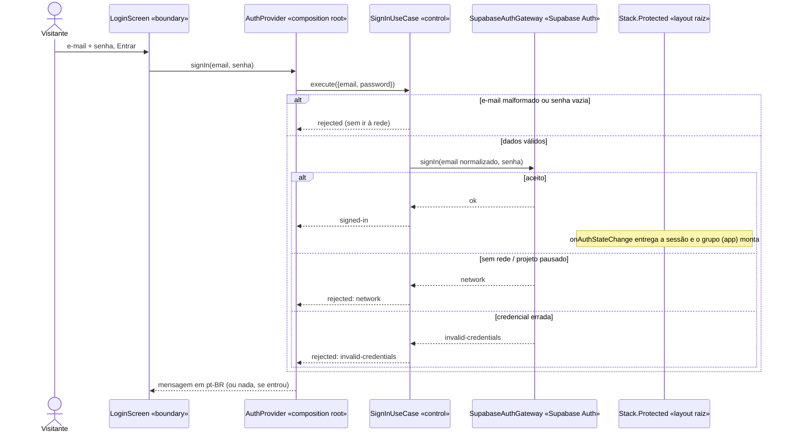

# 7 · Diagramas de Sequência

[← Fronteira, controle e entidade](06-fronteira-controle-entidade.md) · [Índice](README.md) · [Próximo: Atividades →](08-atividades.md)

Os participantes têm os mesmos nomes da tabela da [§6](06-fronteira-controle-entidade.md#tabela-de-mapeamento-por-caso-de-uso) e a ordem das chamadas é a que os testes da [§10](10-implementacao.md) verificam. Toda ação de escrita mostra **dois momentos separados**: (1) gravação local, síncrona do ponto de vista do usuário e que não falha por falta de rede; (2) sincronização remota, assíncrona e condicionada à conectividade.

## 7.1 UC07 — Registrar série (offline-first + sincronização)

## 7.2 UC10 + UC21 — Desmarcar série já sincronizada

## 7.3 UC11 — Registrar foto de progresso

## 7.4 UC17 — Encontrar academias por perto

## 7.5 UC01 — Entrar (com falha de rede)

