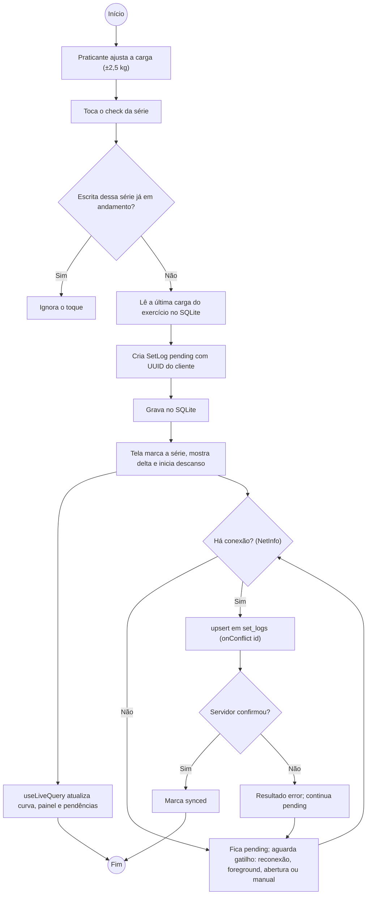
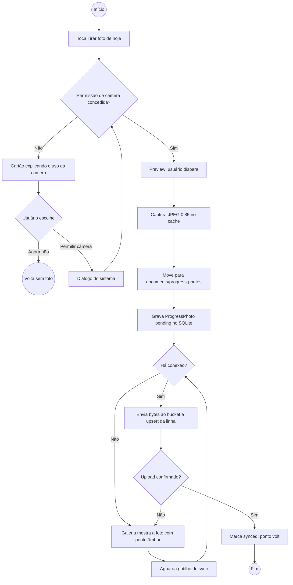
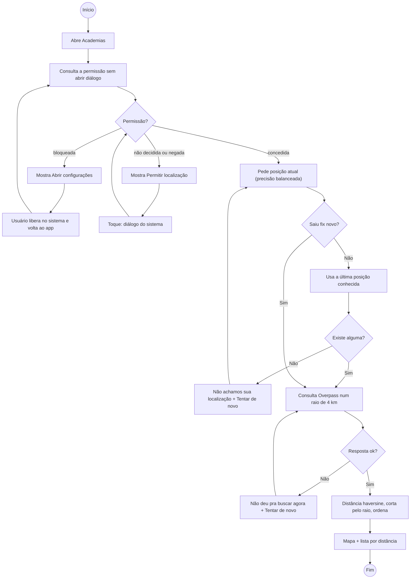

# 8 · Diagramas de Atividades

[← Sequência](07-sequencia.md) · [Índice](README.md) · [Próximo: Componentes →](09-componentes.md)

Um diagrama por processo ponta a ponta. Os dois pontos de ramificação típicos de app mobile — **permissão** e **conectividade** — aparecem explicitamente.

## 8.1 Registrar série e sincronizar (UC07 → UC20)

**Raias.** *Praticante*: ajusta carga e marca. *App (primeiro plano)*: grava no SQLite, redesenha, dispara o descanso. *Sistema de Sincronização*: tenta o envio agora e em cada gatilho seguinte. *Supabase*: aceita ou recusa o `upsert`.

## 8.2 Registrar foto de progresso (UC11)

**Raias.** *Praticante*: concede permissão e dispara. *App*: captura, move o arquivo, grava. *Sistema de Sincronização*: sobe a foto quando houver rede. *Supabase Storage*.

## 8.3 Encontrar academias (UC17)

**Raias.** *Praticante*: abre a tela e concede permissão. *App*: `FindNearbyGymsUseCase` + `ExpoLocationGateway`. *GPS do aparelho*. *OpenStreetMap (Overpass)*.

Em nenhum dos três processos a posição, a falta de rede ou a falta de permissão derruba o app ou prende o usuário: todo caminho termina em um estado com ação possível (repetir, sair, abrir configurações) — é o RNF02/RNF03 visto como fluxo.
