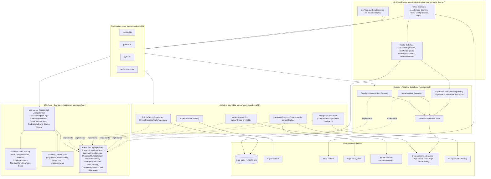

# 9 · Diagrama de Componentes

[← Atividades](08-atividades.md) · [Índice](README.md) · [Próximo: Implementação →](10-implementacao.md)

Visão estrutural do monorepo — a materialização das camadas da [§10](10-implementacao.md). Setas apontam de quem depende para quem é dependido.

## Regras de leitura (e como são garantidas)

| Regra | Situação | Como conferir |
|---|---|---|
| `Core` não tem seta saindo para `Adapters`/`Infra` | **Cumprida** — `packages/core/src` não importa nenhum pacote externo | `grep -rhoE 'from "[^".][^"]*"' packages/core/src` não retorna nada |
| `expo-*`, `drizzle-orm` e `supabase-js` só em adapters/infra | **Cumprida**, com duas exceções justificadas: `camera.tsx`/`scanner.tsx` usam `CameraView` (componente de UI), e o `_layout.tsx` raiz aplica as migrations no boot | `grep -rlE 'from "(drizzle-orm|@/db)' apps/mobile/src/app` → só `_layout.tsx` |
| Telas não fazem SQL nem chamam o Supabase | **Cumprida** — leituras reativas moram em `lib/use-*.ts` e leituras remotas em `lib/remote.ts` | idem |
| O "onde SQLite e Supabase se encontram" é um lugar só | **Cumprida** — os composition roots de `apps/mobile/src/lib` | leitura de `workout.ts`, `photos.ts` |

## Detalhes por plataforma

- **Mapa**: `gym-map.tsx` (iOS, Apple Maps via `react-native-maps`, sem chave) e `gym-map.android.tsx` (MapLibre + tiles raster do OSM). O Metro escolhe pela extensão — nenhum `if (Platform.OS)` na tela.
- **Web (`apps/web`)**: fala com o mesmo projeto Supabase, mas **não** importa nenhum pacote `@px/*` hoje — tem cliente, tipos e regras próprios (domínio duplicado; ver lacunas).
